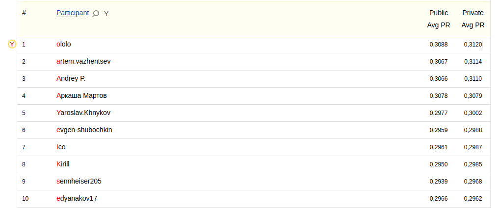

1st place solution in Yandex Cup 2023 - ML RecSys (audio classification).



Make final submission (inference of each model + blending):
1. `pip install -r requirements.txt`
2. Download and unpack [embeddings](https://disk.yandex.ru/d/k-tAIJBnWyo7tA)
3. Download and unpack [models](https://disk.yandex.ru/d/5ohGVa5XDx9GKg). Structure is exactly the same as in `models`, but files `pytorch_model.bin` are in `checkpoint-*` directories.
4. Modify `models_dir`, `embeddings_dir`, `blended_output_path` (optional, ensemble output), `ensemble_path` (optional, ensemble config path: choose between two files in `ensembles` directory) in `bin/predict_ensemble.sh`
5. Run inference:
    ```bash
    cd bin
    bash predict_ensemble.sh
    ```

I have loaded two best submissions:
* `ensembles/ensemble_v30.tsv` - public score: 0.3095, private score: 0.3128.
* `ensembles/ensemble_v31.tsv` - public score: 0.3087, private score: 0.3120. Was selected as final.

Re-train whole ensemble (train each model on 3 splits of 10-folds kf):
```bas
cd bin
bash re_train_ensemble.sh
```

Code for models selection: `src/beam_search.py`